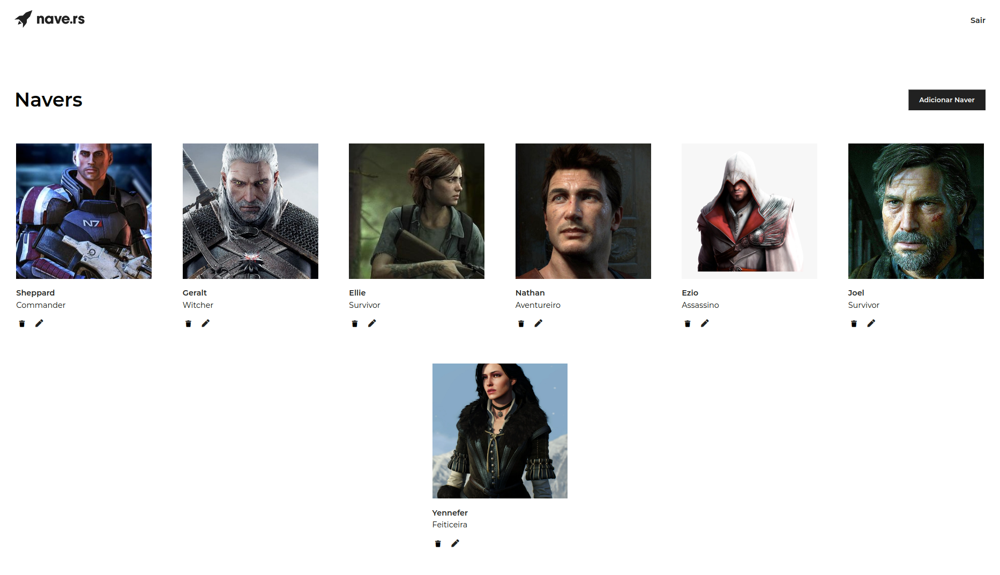
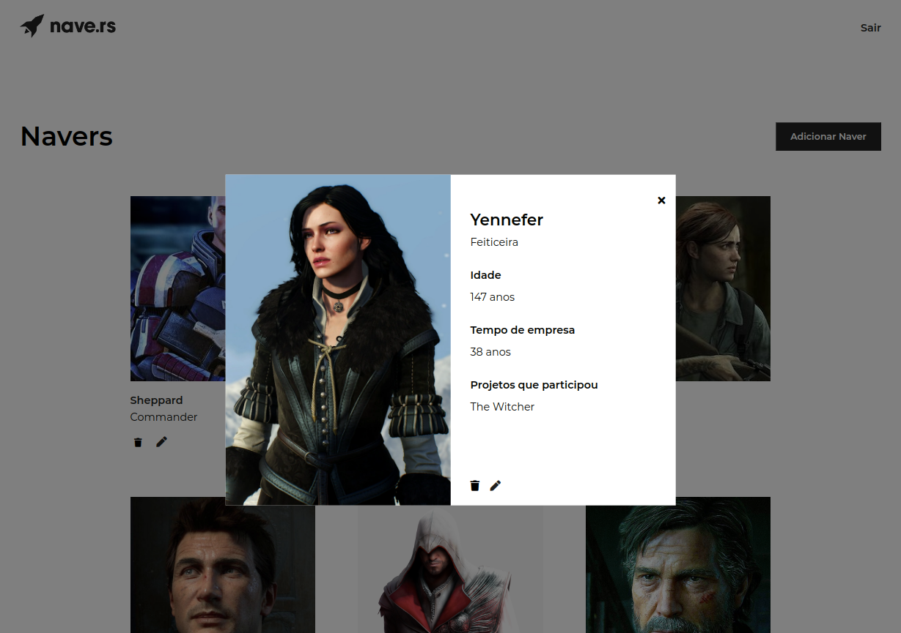

<h1>  Front-End Challenge - NaveDex </h1>

## Screenshots:




## Tecnologias:

React | Hooks | API | axios | styled-components

## Para rodar localmente:

Faça o download do projeto, abra o terminal na pasta e coloque os seguintes comandos:

```
npm install
npm start
```

Na tela de <strong>Login</strong>, use os dados abaixo:

```
login: testing@test.com
senha: nave1234
```

## Dificuldades

A minha maior dificuldade foi quanto ao Modal. Ele me lembrou que devemos pensar como React, e por vezes, no desenvolvimento, somente lembramos disso quando os erros não desaparecem do console.

## Agradecimentos

Este teste foi uma grande experiência e oportunidade para o meu crescimento profissional. Afinal, são nesses desafios que percebemos onde devemos melhorar e o quanto evoluimos até a entrega. Obrigada, Nave.rs!
